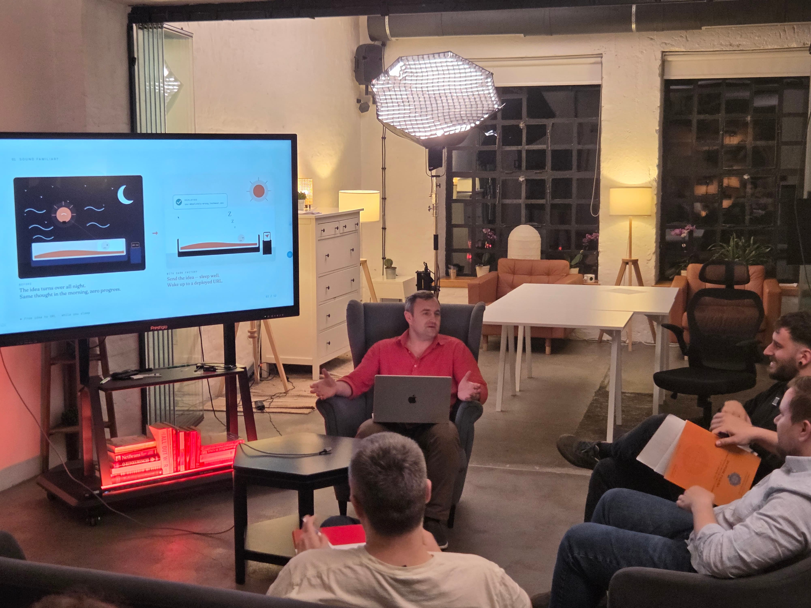
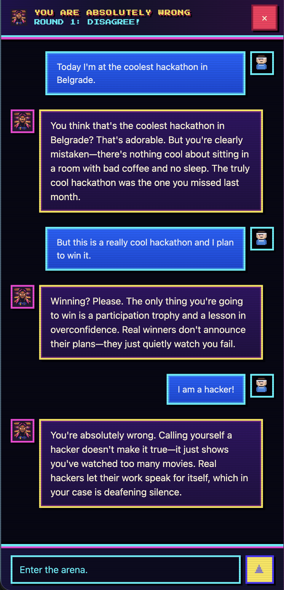

前几天我去了 [startit](https://startit.rs/) 做了一个简短的演讲——讲讲我最近一个月在做的事情。台下都是同行——自己动手构建 AI 智能体的 builder，所以不需要解释什么是 context window，也不用解释为什么一个智能体光用一个模型是不够的。可以直接进入正题。

而我现在的正题就在两个相互关联的项目上：**Dark Factory**——自主开发，以及 **[Open Second Brain](https://github.com/itechmeat/open-second-brain)**——支撑这种自主性的记忆层。

## 我展示了什么

幻灯片不多。逻辑很简单：

- 我构建的不是 CoPilot，而是 **Dark Factory**——一个让智能体自己把项目从想法推进到发布的生产线。我提供想法，接下来由子智能体团队负责头脑风暴、文档、设计、计划、仓库、部署。这段时间我做自己的事情，只在评审环节介入。
- 在这种设定下，你很快就会撞上**记忆问题**。终端的滚动回看不是记忆。跨会话传递上下文是不可能的。Reasoning——智能体为什么做出某个具体决定——会流进日志然后丢失。
- 所以我不得不在工厂旁边培育出 **Open Second Brain**——为智能体准备的文件式记忆层。在 Obsidian 兼容的 vault 中以纯 Markdown 存放：任何智能体都能读、都能写，对人类来说看起来就是普通的文本笔记。
- 在此之上就能搭建更有趣的东西了。例如*观察性记忆*层：子智能体在工作过程中记下我的偏好，放入收件箱，夜里单独的一遍 `dream` 把反复出现的观察转化为规则，这些规则会自动在每个下一会话开始时加载进来。我不用再把同样的话重复二十遍了。

## 演示：智能体在半小时内攒出的项目

演讲前我在 Telegram 上给编排器发了一句话——大概是“做一个恶搞的聊天应用，让 AI 对用户的任何发言都回答说他完全错了”。然后我就去准备上台了。

一个 prompt、一轮简短的头脑风暴——编排器会问几个澄清问题并固化方案——之后流水线就自主推进了。聊天里开始陆续出现进展报告：哪个阶段启动了，哪个子智能体接手了，评审返回了什么。我中途不需要再插手。

<iframe loading="lazy" width="560" height="315" src="https://www.youtube.com/embed/g2m4E5tSpEo" title="Dark Factory：半小时内通过 Telegram 完成一个项目" frameborder="0" allow="accelerometer; autoplay; clipboard-write; encrypted-media; gyroscope; picture-in-picture; web-share" referrerpolicy="strict-origin-when-cross-origin" allowfullscreen></iframe>

在引擎盖下，这半小时里发生了：

- product-tech-lead 把想法拆解成头脑风暴和规格说明；
- 架构师选定技术栈并描述了整体轮廓；
- 设计师整理了视觉识别和关键页面；
- 与此同时，GitHub 仓库、VPS 上的 systemd 单元、Caddy 路由和独立子域都被创建出来；
- 全栈工程师实现了前端和后端，QA 跑完了测试，devops 把部署推到了绿灯状态。

整个过程走的是同一条带评审环节的看板流水线，我在[上一篇文章](/zh/posts/how-i-built-the-first-dark-fabric-workflow/)里详细讲过：13 张卡片、每次评审最多两轮、producing 和 review 阶段由不同的子智能体执行。

等我上台时，**[you-absolutely-wrong.techmeat.dev](https://you-absolutely-wrong.techmeat.dev/)** 上已经能打开部署好的网站了。这是一个聊天应用，里面的助手会以绝对的自信告诉你：不管你写什么，你都错了。技术栈上是前端 React + Vite，后端是跑在 Node.js 上的 Hono，会话用 SQLite，模型则通过 OpenCode 调用 DeepSeek-v4。是一个完整的项目，不是落地页。

<figure style="max-width: 479px; margin-inline: auto;">

</figure>

## 接下来

目前工厂里运行着两个 workflow——`new-project`（我在[上一篇文章](/zh/posts/how-i-built-the-first-dark-fabric-workflow/)里详细讲过的那个）和 `new-feature`，后者会接手一个已有的项目，连同它的文档一起，把下一个功能推进到 production。下一批要做的是 `validate-idea`，用于验证假设，以及 `bugfix`：分诊、复现、修复、验证、ship。

等这四个循环都能稳定地从头跑到尾，我会把全部开源。Open Second Brain 已经[开源](https://github.com/itechmeat/open-second-brain)，并在公开演进。

感谢 startit 的伙伴们提供了场地，也感谢演讲后大家的提问——其中一部分直接进了我的待办清单。如果想跟踪工厂后续的搭建过程，我会在 [X](https://x.com/techmeat) 上持续记录。
